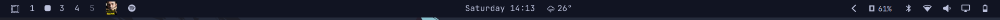
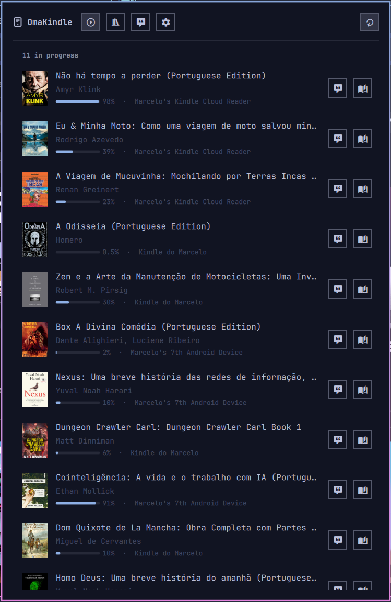
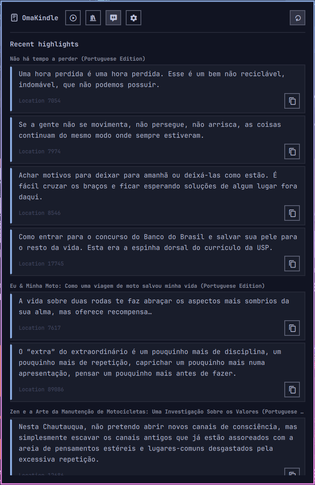

# OmaKindle

Your Kindle library, reading progress, and highlights in the Omarchy bar.

The bar shows the cover of the book you are currently reading. The panel adds
a continue-reading list, the full library with search, and your highlights
with notes and locations. Everything is read-only. The bar style is
configurable: cover, cover and title, title, or icon.

Amazon publishes no API for a personal Kindle library, so this plugin talks to
the same private `read.amazon.com` endpoints the Kindle Cloud Reader uses,
with a browser-grade TLS fingerprint. It is unofficial, may break when Amazon
changes something, and is intended for personal use with your own account.



| Continue | Highlights |
|---|---|
|  |  |

## Requirements

- Omarchy with the Quickshell shell
- A Rust toolchain to build the backend: `mise use -g rust@stable` plus
  `mise use -g cmake@latest` (BoringSSL is compiled in)
- For the one-click sign-in: `uv` and a Chromium-based default browser
  (Playwright is installed by `uv run --locked` from the committed
  `scripts/authorize.py.lock`, which pins every version and hash; the browser
  driver downloads once)
- For manual setup: just a browser with developer tools

Dependencies: Rust crates from crates.io (locked in `backend/Cargo.lock`),
`playwright` from PyPI, pinned by `scripts/authorize.py.lock` and installed
by `uv run --locked` for the sign-in helper, and the system browser it drives.
No telemetry and no third-party services beyond Amazon.

## Install

```bash
omarchy plugin add https://github.com/minholi/omakindle.git --enable
~/.config/omarchy/plugins/minholi.kindle/scripts/backend.sh build
```

If you cloned it yourself instead, run the build script from the plugin folder
and enable it with `omarchy plugin enable minholi.kindle left`. Once listed,
the plugin is also installable from the Omarchy plugin marketplace.

## Set up your Amazon session

The plugin never sees your password. It reuses the browser session from
`read.amazon.com`, which stays valid for about a year.

**Sign in from the panel (recommended).** Open the panel → **Settings** →
**Sign in with Amazon**. The plugin opens your default browser through
Playwright with a dedicated profile (`~/.cache/omakindle/browser`), you sign
in (2FA included), and it captures the cookies and the `deviceToken` the
Kindle reader sends, then stores them. Cookies expire after roughly a year;
repeat the sign-in to renew. If Amazon changes the reader flow and the device
token cannot be observed, the cookies are still saved and Settings asks for
just the token.

**Manual fallback.**

1. Open <https://read.amazon.com> in your browser and sign in.
2. Open DevTools (F12) → **Network** tab and reload the page.
3. Click any request to `read.amazon.com`, find the `cookie:` request header,
   and copy its value.
4. In the plugin, open the panel → **Settings** and paste it into **Cookies**.
5. Back in DevTools, filter for `getDeviceToken`. If nothing appears, open a
   book in the Cloud Reader to trigger it. Right-click the request →
   **Copy → Copy URL** and paste that into **Device token**.
6. Pick your region (for example `us`, `uk`, `de`) and press **Save session**.

The session is stored owner-only at `~/.config/omakindle/session.json`. The first
refresh takes a little while: progress is fetched per book and Amazon has no
bulk endpoint for it.

## Panel

- **Continue** — books with progress, sorted by last sync, with covers,
  percent, and buttons for the Cloud Reader and highlights.
- **Library** — every owned book, searchable by title or author.
- **Highlights** — opened without a book selected, it scans recent books and
  shows a selection of quotes across them; picking a book (or "Quotes" on a
  row) shows that book's highlights with color, location, notes, and a copy
  button that appends the author and title citation. Results are cached in
  the backend for 30 minutes and refreshed in the background.
- **Settings** — session, region, and refresh interval.

## Caveats

- Unofficial API: read-only, personal use. Using it may violate Amazon's terms.
- Highlights come from the Cloud Reader annotations API and are cached for
  30 minutes. Amazon returns a short preview for long highlights; the plugin
  fetches the full passage in the background (and when you press Copy). If
  Amazon refuses to serve a book, the quote stays a preview marked with "…".
- Amazon's web notebook page now requires a recent password login, so the
  plugin does not use it; bookmarks are skipped and pages are not shown.
- Book text is DRM-protected; the plugin only reads metadata, covers, progress,
  and your own annotations.
- Cookies expire after roughly a year or when Amazon signs the session out.
  Save fresh cookies in Settings to recover.

## Uninstall

```bash
omarchy plugin disable minholi.kindle
omarchy plugin remove minholi.kindle
rm -rf ~/.local/lib/omakindle ~/.cache/omakindle ~/.config/omakindle
```
